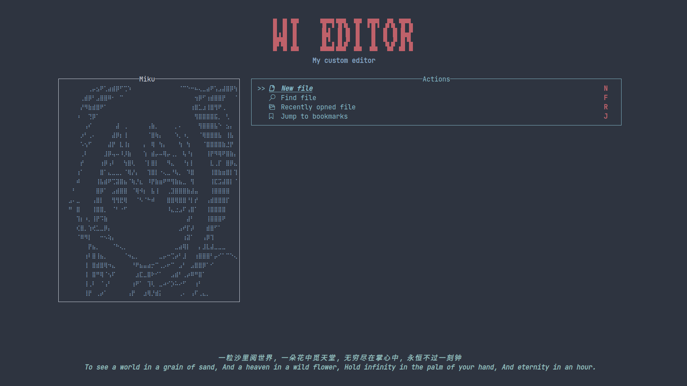

# tui-dashboard
A dashboard widget for ratatui, WIP

## Show



## Note
If you want to use icon, you should make sure that the terminal support [nerd fonts](https://www.nerdfonts.com/)

## Usage

```rust
// examples/miku.rs

fn render(frame: &mut Frame) -> AppResult<()> {
    let avatar = " \
⠀⠀⠀⠀⢀⡤⣢⠟⢁⣴⣾⡿⠋⢉⠱⠀⠀⠀⠀⠀⠀⠀⠀⠀⠀⠀⠀⠈⠉⠑⠒⠦⢄⣀⣴⠟⢡⣠⣼⣿⡿⢳⣄⡀⠀⠀
⠀⠀⠀⢀⣾⡿⠃⣠⣿⣿⠿⠂⠀⠉⠀⠀⠀⠀⠀⠀⠀⠀⠀⠀⠀⠀⠀⠀⠀⠀⠀⠀⢲⡿⠋⢰⣾⣿⣿⡟⠀⠀⠈⠙⢆⠀
⠀⠀⠀⡜⠻⣷⣾⣿⠟⠁⠀⠀⠀⠀⠀⠀⠀⠀⠀⠀⠀⠀⠀⠀⠀⠀⠀⠀⠀⠀⠀⢰⣿⣁⣰⢸⣿⢻⠟⢀⠀⠀⠀⠀⠀⠁
⠀⠀⠰⠀⠀⢙⡿⠁⠀⠀⠀⠀⠀⠀⠀⠀⠀⠀⠀⠀⠀⠀⠀⠀⠀⠀⠀⠀⠀⠀⠀⠀⢻⣿⣿⣿⣿⣯⡀⠀⢃⠀⠀⠀⠀⠀
⠀⠀⠀⠀⢠⠎⠀⠀⠀⠀⠀⠀⣼⠀⢀⠀⠀⠀⠀⠀⢠⣷⡀⠀⠀⠀⠀⡀⠄⠀⠀⠀⠀⢻⣿⣿⣿⣧⠑⠀⣢⡄⠀⠀⠀⠀
⠀⠀⠀⡰⠃⢀⠄⠀⠀⠀⠀⣼⡿⡆⢸⠀⠀⠀⠀⠀⠈⣿⢷⡄⠀⠀⠀⠱⡀⠰⡀⠀⠀⠈⢿⣿⣿⣿⣧⠀⢸⣧⠀⠀⠀⠀
⠀⠀⠀⠡⢢⠋⠀⠀⠀⠀⣼⡟⠀⣇⢸⡆⠀⠀⠀⡄⠀⢿⠀⢳⡄⠀⠀⠀⢳⠀⢳⠀⠀⠀⠈⣿⣿⣿⣿⣷⣘⡟⠀⠀⠀⠀
⠀⠀⠀⢀⠇⠀⠀⠀⠀⣸⡿⢤⠤⠸⡸⣷⠀⠀⠀⢱⠀⣾⡤⠤⢿⡤⢀⡀⠀⢧⠘⡆⠀⠀⠀⢸⡟⠻⢿⠟⣿⣷⡄⠀⠀⠀
⠀⠀⠀⡞⠀⠀⠀⠀⢰⡿⢠⠇⠀⠀⢳⣿⢇⠀⠀⠈⡇⣿⡇⠀⠀⠻⣄⠀⠀⠘⡆⡇⠀⠀⠀⠀⣇⢀⡏⠀⣿⡿⣄⠀⠀⠀
⠀⠀⢰⠁⠀⠀⠀⠀⣿⠁⣄⣀⣀⡀⠈⢿⡜⡄⠀⠀⢹⣿⡇⠐⢄⣀⠘⢧⡀⠀⠹⣿⠀⠀⠀⠀⢸⣿⣷⣶⣿⡇⢹⡇⠀⠀
⠀⠀⠾⠀⠀⠀⠀⢸⣧⣾⠟⢉⣽⣿⣦⠈⢷⡘⣆⠀⠸⡟⣷⣶⠟⠛⢻⣷⣦⣀⠀⢻⠀⠀⠀⠀⢸⣏⣩⣼⣿⡇⠈⣷⠀⠀
⠀⠃⠀⠀⠀⠀⠀⣿⡿⠁⠀⣠⣾⣿⣿⠀⠈⢿⠺⡆⠀⣧⢸⠀⠀⢀⣹⣿⣿⣿⣷⣼⣤⠀⠀⠀⢸⣿⣿⣿⣿⠀⠀⣿⠀⠀
⣠⠄⣀⠀⠀⠀⢠⣿⡇⠀⠀⢻⢻⣟⢿⠀⠀⠈⠣⠈⠓⠾⠀⠀⠀⣿⣿⢿⣿⣿⠘⡇⡞⠀⠀⢠⣾⣿⣿⣿⡏⠀⠀⢹⠀⠀
⠛⠀⣿⠀⠀⠀⢸⣿⣿⡀⠀⠈⠃⠐⠋⠀⠀⠀⠀⠀⠀⠀⠀⠀⠀⠸⣄⣐⣠⠏⢠⣿⠁⠀⠀⢸⣿⣿⣿⣿⠀⠀⠀⢸⠀⠀
⠀⠀⢹⡆⠰⡀⢸⡟⠩⣷⠀⠀⠀⠀⠀⠀⠀⠀⠀⠀⠀⠀⠀⠀⠀⠀⠀⠀⠀⠀⣼⠃⠀⠀⠀⢸⣿⣿⣿⠟⠀⠀⠀⠘⠀⠀
⠀⠀⢎⣿⡀⢱⢞⣁⣀⡿⡄⠀⠀⠀⠀⠀⠀⠀⠀⠀⠀⠀⠀⠀⠀⠀⠀⠀⣠⠞⡏⡼⠀⠀⠀⣾⣿⠋⠁⠀⠀⠀⠀⠀⠀⠀
⠀⠀⠈⠿⠻⡇⠀⠀⠒⠢⢵⡄⠀⠀⠀⠀⠀⠀⠀⠀⠀⠀⠀⠀⠀⠀⠀⠀⠀⢰⣽⠁⠀⠀⢠⡿⢹⠀⠀⠀⠀⠀⠀⠀⠀⠀
⠀⠀⠀⠀⠀⡟⣦⡀⠀⠀⠀⠈⠓⢄⡀⠀⠀⠀⠀⠀⠀⠀⠀⠀⠀⠀⠀⣀⣴⢿⡇⠀⠀⡄⣸⣇⣼⣀⣀⣀⠀⠀⠀⠀⠀⠀
⠀⠀⠀⠀⢰⠇⣿⢸⣦⡀⠀⠀⠀⠀⠈⠲⣄⡀⠀⠀⠀⠀⠀⣀⡤⠒⢉⡴⠃⣸⠀⠀⢰⣿⣿⣿⠃⡤⠊⠁⠉⠑⢄⠀⠀⠀
⠀⠀⠀⠀⢸⠀⣿⣾⣿⢿⠲⣄⠀⠀⠀⠀⠘⠟⣦⣤⣴⡒⠉⢀⡠⠖⠉⠀⣠⠃⠀⣠⣿⣿⡿⠁⠊⠀⠀⠀⠀⠀⠀⠀⠀⠀
⠀⠀⠀⠀⢸⠀⣿⠛⢿⠈⢢⠏⠀⠀⠀⠀⠀⣰⣏⣀⣿⠗⠊⠁⠀⠀⣠⣾⠃⢀⡴⠿⠛⣿⠁⠀⠀⠀⠀⠀⠀⠀⠀⠀⠀⠀
⠀⠀⠀⠀⢸⢀⠇⠀⠈⢠⠃⠀⠀⠀⠀⠀⢰⠟⠁⠀⢹⢇⠀⣀⠴⠊⡱⠥⠔⠋⠀⠀⢰⠃⠀⠀⠀⠀⠀⠀⠀⠀⠀⠀⠀⠀
⠀⠀⠀⠀⢸⡟⠀⢀⡴⠁⠀⠀⠀⠀⠀⢠⡟⠀⠀⣰⢿⡘⣾⡅⠀⠀⠀⠀⢀⠄⠀⢠⠏⢀⣄⡀⠀⠀⠀⠀⠀⠀⠀⠀⠀⠀
⠀⠀⠀⠀⢸⠀⣰⣿⠀⠀⠀⠀⠀⠀⢠⣿⠃⢀⡾⡇⠘⠻⡿⢷⡀⠀⠀⠒⠁⠀⢠⠏⢀⠏⣸⠃⢻⠏⠀⠀⠀⠀⠀⠀⠀⠀
⠀⠀⠀⠀⣧⣾⣹⣿⠀⠀⠀⠀⠀⢠⠏⢉⠀⡞⣰⡇⠀⣴⣥⠞⢷⠀⠀⠀⠀⣠⠎⠀⠸⣶⠋⣠⡟⠀⠀⠀
";

    let dashboard = DashboardBuilder::default()
        .general_title("WI EDITOR")
        .subtitle("My custom editor")
        .table(vec![
            ("  New file", "n"),
            ("  Find file", "f"),
            ("  Recently opned file", "r"),
            ("  Jump to bookmarks", "j"),
        ])
        .table_block(Block::bordered().title("Actions").title_alignment(Alignment::Center))
        .avatar(avatar)
        .avatar_block(Block::bordered().title("Miku").title_alignment(Alignment::Center))
        .footer(vec![
            "一粒沙里阅世界, 一朵花中觅天堂, 无穷尽在掌心中, 永恒不过一刻钟",
            "To see a world in a grain of sand, And a heaven in a wild flower, Hold infinity in the palm of your hand, And eternity in an hour.", 
        ])
        .build();
    let mut selected = TableState::new().with_selected(0);
    frame.render_stateful_widget(dashboard, frame.size(), &mut selected);

    Ok(())
}
```


